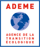

  

    

      <h2>
          <a href="https://www.ademe.fr/">
            Ademe
          </a>
      </h2>
    

    

      
    

  

  

    <ul class="pulse-team-member">
      <li>Julia Meyer</li>
    </ul>
  

  

    

      <h2>
          <a href="https://www.inria.fr/fr">
            Inria
          </a>
      </h2>
    

    

      
    

  

  <a href="https://avalon.ens-lyon.fr/">
    <h4 class="pulse-inria-team-title">Avalon Team - Centre Inria de Lyon</h4>
  </a>
  

      <ul class="pulse-team-member">
        <li>Laurent Lefèvre</li>
      </ul>
  

  <a href="https://team.inria.fr/ctrl-a/fr/">
    <h4 class="pulse-inria-team-title">Ctrl-A Team - Centre Inria de l'Université Grenoble Alpes</h4>
  </a>

  

      <ul class="pulse-team-member">
        <li>Raphaël Bleuse</li>
        <li>Kouds Halitim</li>
        <li>Bogdan Robu</li>
        <li>Eric Rutten</li>
      </ul>
  

  <a href="https://team.inria.fr/spirals/">
    <h4 class="pulse-inria-team-title">Spirals Team - Centre Inria de l'Université de Lille</h4>
  </a>
  

      <ul class="pulse-team-member">
        <li>Mohammed Chakib Belgaid</li>
        <li>Sophie Cerf</li>
        <li>Thomas Collignon</li>
        <li>Daniel Romero Acero</li>
        <li>Romain Rouvoy</li>
        <li>Lionel Seinturier</li>
      </ul>
  

  <a href="https://stack-research-group.gitlabpages.inria.fr/web/">
    <h4 class="pulse-inria-team-title">Stack Team - Centre Inria de l’Université de Rennes</h4>
  </a>
  

      <ul class="pulse-team-member">
        <li>Adrien Lebre</li>
        <li>Cherif Si-Mohammed</li>
      </ul>
  

  <a href="https://topal.gitlabpages.inria.fr/">
    <h4 class="pulse-inria-team-title">Topal Team - Centre Inria de l'Université de Bordeaux</h4>
  </a>
  

      <ul class="pulse-team-member">
        <li>Olivier Beaumont</li>
        <li>Lionel Eyraud-Dubois</li>
        <li>Esragul Korkmaz</li>
      </ul>
  

  <a href="https://team.inria.fr/storm/">
    <h4 class="pulse-inria-team-title">Storm Team - Centre Inria de l'Université de Bordeaux</h4>
  </a>
  

      <ul class="pulse-team-member">
        <li>Laércio Lima Pilla</li>
      </ul>
  

  <a href="https://www.inria.fr/fr/lille-inria-cultive-lesprit-start-up">
    <h4 class="pulse-inria-team-title">STIP - Centre Inria de l'Université de Lille</h4>
  </a>
  

      <ul class="pulse-team-member">
        <li>Marie Lhoutellier</li>
      </ul>
  

  

    

      <h2>
          <a href="https://qarnot.com">
            Qarnot
          </a>
      </h2>
    

    

      
    

  

  

    <ul class="pulse-team-member">
      <li>Rémi Bouzel</li>
      <li>Yoann Ricordel</li>
      <li>Nicolas Saintherant</li>
      <li>Alexandre Van Kempen</li>
    </ul>
  

