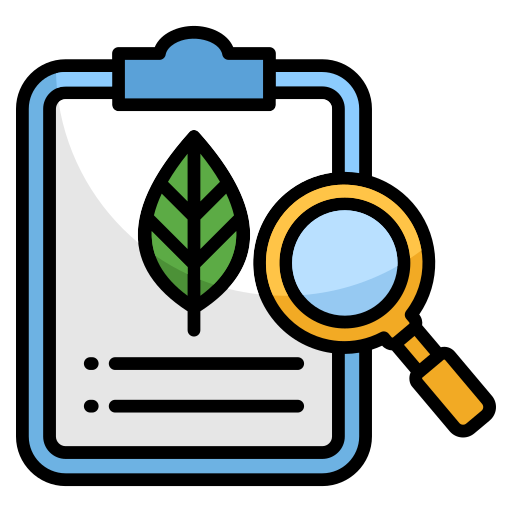

  <table class="pulse-table-home">
    <tbody>
      <tr>
        <td class="pulse-table-td-home">
          <h2>
            
            Analyzing HPC environmental impact
          </h2>
        </td>
      </tr>
      <tr>
        <td class="pulse-table-td-home">
          

            By comparing the energy and carbon efficiency of geo-distributed computation infrastructures with central ones via open source tools.
          

        </td>
      </tr>
    </tbody>
  </table>

  <table class="pulse-table-home">
    <tbody>
      <tr>
        <td class="pulse-table-td-home">
          <h2>
            
            Implementing greener edge services
          </h2>
        </td>
      </tr>
      <tr>
        <td class="pulse-table-td-home">
          

            By controlling emissions from HPC tasks and data storage.
          

        </td>
      </tr>
    </tbody>
  </table>

# Consortium

  

    
  

  

    
  

  

    
  

